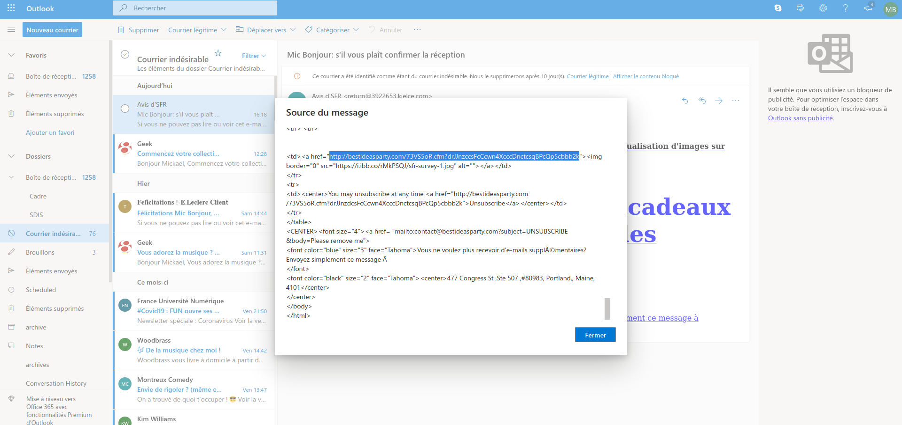

# The Social-Engineer Toolkit (SET)

## Introduction

Selon la propre description donnée par [TrustedSec, LLC](https://www.trustedsec.com), la société de consulting américaine responsable du développement de ce produit, le [Social-Engineer Toolkit](https://github.com/trustedsec/social-engineer-toolkit/) est un framework de test d'intrusion open-source conçu pour l'ingénierie sociale. Le SET dispose d'un certain nombre de vecteurs d'attaque personnalisés qui vous permettent de réaliser rapidement une attaque crédible.

Le SET est spécifiquement conçu pour réaliser des attaques avancées contre l'élément humain. Il est rapidement devenu un outil standard dans l'arsenal des testeurs de pénétration. Les attaques intégrées dans la boîte à outils sont conçues pour être des attaques ciblées contre une personne ou une organisation utilisées lors d'un test de pénétration.


## Téléchargement et installation

Le SET est nativement supporté sur Linux et sur Mac OS X (experimental). Il est préinstallé sur Kali Linux et il est capable de se mettre à jour lui-même.

Pour une installation sur Ubuntu/Debian/Mac OS X :

```
git clone https://github.com/trustedsec/social-engineer-toolkit/ setoolkit/
cd setoolkit
pip3 install -r requirements.txt
python setup.py
```

## Que faut-il faire ?

Vous devez installer le Social Engineering Toolkit (SET), créer un collecteur d'identifiants (credential harvester), capturer certains identifiants utilisateur (les vôtres), créer une attaque de phishing, relier le collecteur d'identifiants à l'attaque. Pour chaque tâche, faites des captures d'écran de vos activités.

## Note sur l'éthique

Il n'est absolument pas acceptable d'attaquer quelqu'un pour quelque raison que ce soit. 

L'utilisation de cet outil à des fins autres que votre propre éducation et formation sans autorisation est strictement interdite par les politiques de ce cours et de l'école, ainsi que par les lois. 

Le but de cet exercice est de vous permettre de vous familiariser avec les outils et comment ils peuvent être utilisés dans le context professionnel d'un pentest. Ça vous permettra aussi de comprendre les tactiques de l'adversaire afin de pouvoir les contrer par le biais de la politique, de l'éducation et de la formation.

## Execution de SET

Pour executer SET, dans votre terminal tapper :

```
setoolkit
```

Dépendant de votre OS et de votre installation particulière, il est possible que certaines fonctionnalités ne soient pas disponibles au moins d'utiliser ```sudo```.

```
sudo setoolkit
```

# Exercice 1 - Credential Harvesting

Vous découvrirez l'un des outils les plus couramment utilisés par les ingénieurs sociaux et les acteurs malveillants pour tromper les cibles.

### Soumettre des captures d'écran
## Twitter clone ad credentials


## Facebook clone and results


Pour le collecteur d'identifiants, montrez que vous avez cloné un site en indiquant son adresse web et l'interface d'utilisateur. Saisissez les informations d'identification sur votre clone local, puis cliquez le bouton de connexion. Essayez plusieurs sites comme facebook.com, twitter.com, et d'autres qui puissent vous intéresser. Faites des captures d'écran des mots de passe collectés dans vos tests avec SET.

# Exercice 2 - Créer une attaque de phishing

Essayez la fonction d'attaque par phishing. C'est très facile à faire. Vous pouvez vous référer à ce lien pour plus d'informations http://www.computerweekly.com/tutorial/Social-Engineer-Toolkit-SET-tutorial-for-penetration-testers
## Small test with the webmail heig


# Exercice 3 - Explorer les liens "Phishy" et le courrier électronique "Phishy"

Pour cette dernière partie de notre exploration du phishing, nous allons utiliser un contenu réalisé par les  Dr. Matthew L. Hale, le Dr. Robin Gandhi et la Dr. Briana B. Morrison de [Nebraska GenCyber](
http://www.nebraskagencyber.com). 

Visitez : https://mlhale.github.io/nebraska-gencyber-modules/phishing/README/ et passez en revue les modules 

- Analyse d'url (ce module peut être intéressant pour vos rapports de pentest, comme outil pour sensibiliser les employés d'une entreprise, mais il risque d'être trop simple pour vous)
- Analyse d'Email (me module est probablement plus intéressant techniquement pour vous)

En général, c'est un bon exemple de matériel de formation et d'éducation qui peut aider à lutter contre les attaques de phishing et à sensibiliser le personnel d'une organisation.

Vous avez la liberté de reproduire et d'utiliser le matériel grace à sa licence.


### Soumettre des captures d'écran

Pour cette tâche, prenez des captures d'écran de :

- Vos inspections de chaque lien dans votre navigateur
- Vos inspections d'un en-tête de courrier électronique à partir de votre propre boîte de réception
## Source du message ici


L'on peut voir que le mail From (?UTF-8?B?QXZpcyBkJ1NGUg==?=<return@3922653.kielce.com>) et Return-Path ne sont pas tout à fait la même chose (return@9711606.kielce.com).
Ordinateur à l'origine : pottsvilleag.org (45.128.159.170), selon ipinfo.io l'adresse vient des pays-bas.
Et on peut voir que le SPF est passé mais qu'il n'a pas de DKIM signature.
Les liens pour un mail de SFR vont vers des adresses étranges : http://bestideasparty.com/73VS5oR.cfm?drJJnzccsFcCcwn4XcccDnctcsqBPcQp5cbbb2k

```
Received: from DM6NAM11HT101.eop-nam11.prod.protection.outlook.com

 (2603:10a6:6:2d::23) by DBBPR03MB5205.eurprd03.prod.outlook.com with HTTPS

 via DB6PR07CA0013.EURPRD07.PROD.OUTLOOK.COM; Sun, 22 Mar 2020 15:18:18 +0000

Received: from DM6NAM11FT011.eop-nam11.prod.protection.outlook.com

 (2a01:111:e400:fc4d::36) by

 DM6NAM11HT101.eop-nam11.prod.protection.outlook.com (2a01:111:e400:fc4d::438)

 with Microsoft SMTP Server (version=TLS1_2,

 cipher=TLS_ECDHE_RSA_WITH_AES_256_GCM_SHA384) id 15.20.2814.13; Sun, 22 Mar

 2020 15:18:17 +0000

Authentication-Results: spf=pass (sender IP is 45.128.159.170)

 smtp.mailfrom=9711606.kielce.com; hotmail.fr; dkim=none (message not signed)

 header.d=none;hotmail.fr; dmarc=permerror action=none

 header.from=3922653.kielce.com;compauth=pass reason=111

Received-SPF: Pass (protection.outlook.com: domain of 9711606.kielce.com

 designates 45.128.159.170 as permitted sender)

 receiver=protection.outlook.com; client-ip=45.128.159.170;

 helo=pottsvilleag.org;

Received: from pottsvilleag.org (45.128.159.170) by

 DM6NAM11FT011.mail.protection.outlook.com (10.13.172.108) with Microsoft SMTP

 Server id 15.20.2814.13 via Frontend Transport; Sun, 22 Mar 2020 15:18:17

 +0000

X-IncomingTopHeaderMarker:

 OriginalChecksum:718DF82F7312F714110E8C1C7902E157A0ADA99FC0145D6ABEF3A7F9ECD2E0B2;UpperCasedChecksum:6B0190358513C457FE013B2EDDB69CC85AD13ED723D40366C8E1542B8234999F;SizeAsReceived:412;Count:8

Date: Sun, 22 Mar 2020 11:17:34 -0400 (EDT)

From: =?UTF-8?B?QXZpcyBkJ1NGUg==?=<return@3922653.kielce.com> 

To: mic.bonjour@hotmail.fr

Sender: <mic.bonjour@hotmail.fr>

Message-ID: <851.45584.45584.3922653.0002463220.988131.vTcP@a2plmmsworker06.prod.iad2.gdg.mail>

Subject: =?UTF-8?B?TWljIEJvbmpvdXI6IHMnaWwgdm91cyBwbGHDrnQgY29uZmlybWVyIGxhIHLDqWNlcHRpb24=?=

Content-Type: text/html;

X-IncomingHeaderCount: 8

Return-Path: return@9711606.kielce.com

X-MS-Exchange-Organization-ExpirationStartTime: 22 Mar 2020 15:18:17.4392

 (UTC)

X-MS-Exchange-Organization-ExpirationStartTimeReason: OriginalSubmit

X-MS-Exchange-Organization-ExpirationInterval: 1:00:00:00.0000000

X-MS-Exchange-Organization-ExpirationIntervalReason: OriginalSubmit

X-MS-Exchange-Organization-Network-Message-Id:

 3dd98bb5-1d86-4de7-c78d-08d7ce743f93

X-EOPAttributedMessage: 0

X-EOPTenantAttributedMessage: 84df9e7f-e9f6-40af-b435-aaaaaaaaaaaa:0

X-MS-Exchange-Organization-MessageDirectionality: Incoming

X-Forefront-Antispam-Report: EFV:NLI;

X-MS-Exchange-Organization-AuthSource:

 DM6NAM11FT011.eop-nam11.prod.protection.outlook.com

X-MS-Exchange-Organization-AuthAs: Anonymous

X-MS-PublicTrafficType: Email

X-MS-UserLastLogonTime: 3/22/2020 3:13:58 PM

X-MS-Office365-Filtering-Correlation-Id: 3dd98bb5-1d86-4de7-c78d-08d7ce743f93

X-MS-TrafficTypeDiagnostic: DM6NAM11HT101:

X-MS-Exchange-EOPDirect: true

X-Sender-IP: 45.128.159.170

X-SID-PRA: RETURN@3922653.KIELCE.COM

X-SID-Result: PASS

X-MS-Exchange-Organization-PCL: 2

X-Microsoft-Antispam: BCL:0;

X-OriginatorOrg: outlook.com

X-MS-Exchange-CrossTenant-OriginalArrivalTime: 22 Mar 2020 15:18:17.3762

 (UTC)

X-MS-Exchange-CrossTenant-Network-Message-Id: 3dd98bb5-1d86-4de7-c78d-08d7ce743f93

X-MS-Exchange-CrossTenant-Id: 84df9e7f-e9f6-40af-b435-aaaaaaaaaaaa

X-MS-Exchange-CrossTenant-FromEntityHeader: Internet

X-MS-Exchange-CrossTenant-RMS-PersistedConsumerOrg:

 00000000-0000-0000-0000-000000000000

X-MS-Exchange-Transport-CrossTenantHeadersStamped: DM6NAM11HT101

X-MS-Exchange-Transport-EndToEndLatency: 00:00:01.4218903

X-MS-Exchange-Processed-By-BccFoldering: 15.20.2835.016

X-Microsoft-Antispam-Mailbox-Delivery:

	abwl:0;wl:0;pcwl:0;kl:0;iwl:0;dwl:0;dkl:0;rwl:0;ucf:0;jmr:0;ex:0;auth:1;dest:J;OFR:SpamFilterAuthJ;ENG:(5062000262)(9000001)(9010001)(9030001)(5061607266)(5061608174)(4900115)(8390131)(8377080)(8383139)(8385121)(8386120)(8403011)(58390011)(98390011)(8399029)(4920090)(6350004)(4950130)(4990090)(9140004);RF:JunkEmail;

X-Message-Info:

	qoGN4b5S4yrmAeNVLAMFDslnOcoUsFCaH3ZBO/myiGJanS2jv0Ihc9uLWAjANY7K6/hDfin+0cnFvHUF6vdLCNQFw7vsv3ehTqX1XtTObQSOC/yl1TDqSZsKVrglPk1KEWQrM/OFe08Z+DY4xjfI1Hte0+Lfu7J8ajE05tW2uTcVCxY4dOfosZrKQ9N6SAF+0Pi14+kEvuYR3hcPdxA+jA==

X-Message-Delivery: Vj0xLjE7dXM9MDtsPTA7YT0wO0Q9MjtHRD0yO1NDTD02

X-Microsoft-Antispam-Message-Info:

	=?iso-8859-1?Q?7gbl/lyxwK7To8dJB33ovtQvnH64ebCjo1t3pORRg+H0/nncghOIgXCP5O?=

 =?iso-8859-1?Q?V+0vXEn/8GDeLGWowiedYduTtzzjLx3z3ku/hEga1KUwYMH5jesyn4eAul?=

 =?iso-8859-1?Q?zGofWNH30i49bAdq5zyl2z7e2tFmIIbIIKhmh32e6wuK6NwEbdDZPayKjH?=

 =?iso-8859-1?Q?lkkorjCIIkCrRysyaVNpbPFLggqCcBqROvo4ooAaxXBNaosNVG4Jiqv2Yf?=

 =?iso-8859-1?Q?EhHPb6YSYpYRR/7TKpC9JA3+3GospwxuYm4ZdKl9WvpROx/AxMxum+F14n?=

 =?iso-8859-1?Q?jHnbjnMnUGWirOB345kZQD6XEhYwV+ST+KT2iyvB6j69yBOtGZA4I3VCyT?=

 =?iso-8859-1?Q?CdtjN5j4pX6cIC9Q9YC9JdaUq440gjDn78QpNY26hymGJrPYruMf32Gynw?=

 =?iso-8859-1?Q?CWMHjBJnpjhdQR6k/mqY0iuA8E7AcyFa5bv/s+MTBuUqhsILR+tlTk5KL2?=

 =?iso-8859-1?Q?zv9S+HNAAmIZth6qlKQiEZanj1nu1WcCue3bw79fgOHh+cIxERmZ9ON059?=

 =?iso-8859-1?Q?iVUryBxr3isk363mgxwgCSSvXsEdmUZa2ND4rY+VoGa8IGaHSDn3x8wh4C?=

 =?iso-8859-1?Q?OUAtYi4vMx1T/HGY9Vw3WDGBvHAgqs7OhWRVCtaPwid1rDnkjh58pKaXUk?=

 =?iso-8859-1?Q?i8OLAX0Pff3thz0Sa5wKFLu4MTVsOG98R1ap4NIKU2Pw72GBDc/Bvtazlg?=

 =?iso-8859-1?Q?lhu9IhZwOuYwAyGkHuQT1k7vifR7+Fc4Jnth3sEYe84tYIR7QpHDZgHNwQ?=

 =?iso-8859-1?Q?ty9rK3DBs4TbUaAtmtDoLQ6cri05B+8TMh3hAb+rE1JLXr/46cCDt5phW2?=

 =?iso-8859-1?Q?o6XYxA495E3uepGpFp8fvbGWlQigEzLOrM83hvxXMqwH0MB6CDMHuegoUe?=

 =?iso-8859-1?Q?hoLqwebNJQOs6CkZxaG4KlyRvMJMsn8d5ZnIuDEysBEV2U+0vBKeJjeE2v?=

 =?iso-8859-1?Q?TaAffPQhF6YmdXpcayfPjPT5LRgYcbG/YxjnAdAc4Q+1JfgW/KqJCW426O?=

 =?iso-8859-1?Q?ZtlpGk1HRZNQ9isPZf0s9phu7g4Qc+mepTFd0Na7X5nrKxibCSyKQkqOB3?=

 =?iso-8859-1?Q?pi4iINMS4qEInmopgelyaxwTNNyFcwz2xwtl61Tmn5VBDZaYqjOPMo0mEA?=

 =?iso-8859-1?Q?3s5ZK4seFAX50n5f8TvFaul9ujW4FPUFWbyFEef3vbSrhbgnEZE9hmVOn/?=

 =?iso-8859-1?Q?SRLeNa+pt5SnnobAEGyQq0rn4gEAiK3UnFnXgF3uTsF25htIOJ9DTI3TaG?=

 =?iso-8859-1?Q?S5/7fQqaT9OEuuOOiKeFVOmjzxEzeW93irgOSF/9L8y9ElWl1d3LiFGPNt?=

 =?iso-8859-1?Q?zeWL?=

MIME-Version: 1.0


<!doctype html>

<html lang="en">

<head>

 <meta charset="UTF-8">

 <title></title>

</head>

<style>

 table {

 width: 35%;

 margin: 0 auto;

 }

 img {

 width: 100%;

 }

 @media (max-width: 1000px) {

 table {

 width: 100%;

 }

 } 

</style>

<body>

 <table>

 <tr>

 

<P style="text-align: center;"><A href="http://bestideasparty.com/73VS5oR.cfm?drJJnzccsFcCcwn4XcccDnctcsqBPcQp5cbbb2k" > <h3> <center><font color="black" face="Garamond" size="3"> Si vous ne pouvez pas lire ou voir cet e-mail. Cliquez ici ou activez la visualisation d'images sur votre navigateur. </font> </img></a><br><br><BR /> </p>

<P style="text-align: center;"><A href="http://bestideasparty.com/73VS5oR.cfm?drJJnzccsFcCcwn4XcccDnctcsqBPcQp5cbbb2k" > <h3> <center><font color="blue" face="Garamond" size="12"> Mic Bonjour ,Les cartes-cadeaux SFR sont disponibles </a> </p> </font> <br> <br>


 <td><a href="http://bestideasparty.com/73VS5oR.cfm?drJJnzccsFcCcwn4XcccDnctcsqBPcQp5cbbb2k"></a></td>

 </tr>

 <tr>

 <td><center>You may unsubscribe at any time <a href="http://bestideasparty.com/73VS5oR.cfm?drJJnzdcsFcCcwn4XcccDnctcsqBPcQp5cbbb2k">Unsubscribe</a></center></td>

 </tr>

 </table>

 <CENTER><font size="4"><a href= "mailto:contact@bestideasparty.com?subject=UNSUBSCRIBE &body=Please remove me">

    <font color="blue" size="3" face="Tahoma">Vous ne voulez plus recevoir d'e-mails supplémentaires? Envoyez simplement ce message à 

</font>

<font color="black" size="2" face="Tahoma"><center>477 Congress St ,Ste 507 ,#80983, Portland,, Maine, 4101</center>

</center>

</body>

</html>

```
